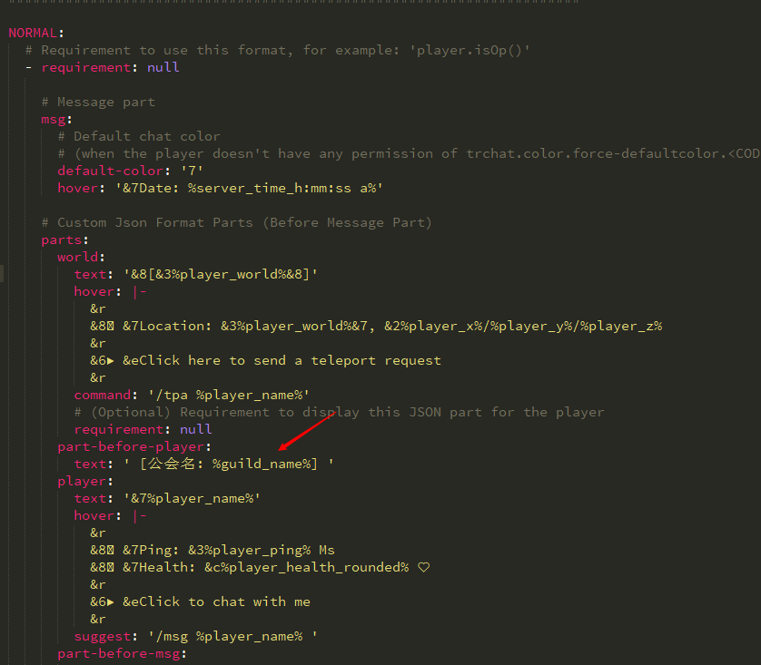
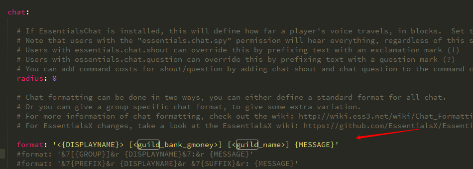
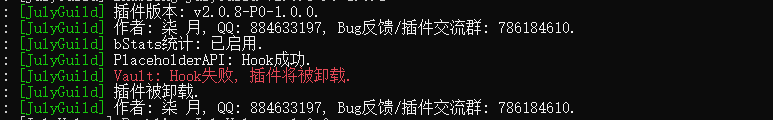
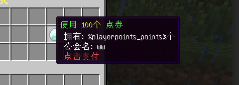
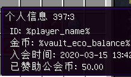
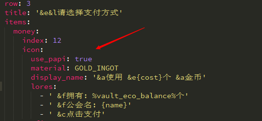
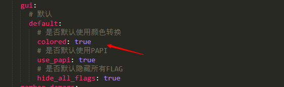
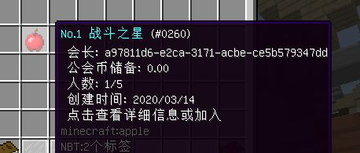

# 如何在 TrChat 中使用 PlaceholderAPI 变量

1. 安装 TrChat 插件。
2. 打开 TrChat 文件夹 config.yml 在箭头所指处添加变量。

   

3. 完成。

# 如何在 Essentials 中使用变量

打开 Essentials 文件夹 config.yml 在箭头所指处添加变量即可。


<u>所有 PlaceholderAPI 变量表里的变量都能使用，只需要把 **%内容%** 改成 **<内容>**。</u>

# Vault Hook 失败

## 问题复现

如下图：



## 解决方案

安装 Vault 支持的经济插件，建议使用 Essentials。

# GUI 内变量不显示

## 问题复现

如下图：





## 解决方案

1. 确保配置中已设置 `use_papi` 为 true。

   

   注意：如果没设置将从 config/settings.yml 中获取缺省值。

   

2. 安装 PlaceholderAPI 后依次输入以下指令：

```
/papi ecloud download Player
/papi ecloud download Vault
/papi ecloud download PlayerPoints
```

2. 重启服务器。

# 玩家名显示为UUID

## 问题复现

如下图：



## 解决方案

确保插件版本为最新，该玩家上线后会自动更新。

新版本已修复这个bug。