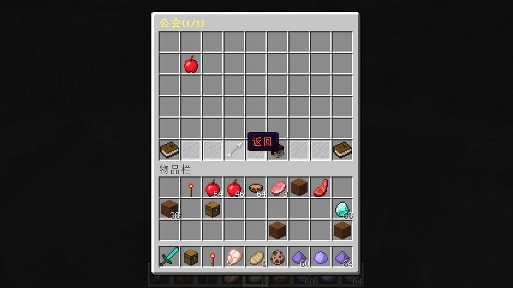

# v2.0.0

* 代码重写
  * GUI，物品能自定义了。
  * 消息可以自定义了。
  * 添加了一些新功能。
  * 修复了旧版本存在的诸多bug。

# v2.0.1

* 修复了不能用金币创建公会的bug。

# v2.0.2

* 优化了入会审核显示。

# v2.0.3

* 修复了解散公会/退出公会时产生的错误。

# v2.0.4

* 代码优化。

# v2.0.5

* 修复了给予成员权限后发生的异常。
* 修复了低版本服务端名字显示为UUID的问题。

# v2.0.6

* 修复了不能踢出成员的bug。

* gui/GuildMineGUI.yml 更新。

* lang.yml 更新。

# v2.0.7

* 修复了默认配置错误的bug。

# v2.0.8

* 修复了 Shift 能将物品放入GUI的bug。
* 修复了不能翻页的bug。

# v2.0.9

* api-version 更改为 1.15。
  高版本（>1.12.2）需要手动修改 material 等相关默认配置。
* 修复了 1.7.10 版本随机传送消息占位符未替换的bug。
* 修复了 GuildMemberManageGUI 的一个权限bug。
* 修复了部分翻页GUI超过数量后出现的bug。
* 修复了高版本自定义头颅（skullTexture）无法显示的问题。
* 增加了公会商店自定义出售物品选项。
  `reward_type: COMMANDS`
* 配置文件优化。
* 增加了公会签到功能。
* 增加了设置公会公告功能。
* 增加了给予设置公告权限功能。
* 增加了 `/jguild debug toggle` 指令来帮助你查找配置文件中的错误。
* 增加了 `/jguild helper` 指令来帮助配置配置文件。

# v2.0.9.1

* 更改了 debug 颜色。

# v2.0.9.2

* 修复了无公会情况下 MainGUI 出现的 bug。

# v2.0.9.3

* 修复了每日签到在特殊情况下可重复签到的 bug。
* 配置文件优化。

# v2.0.9.4, v2.0.9.5

* 更改 api-version 为 1.3.

# v2.1.0

* 修复了玩家创建公会时无彩色公会名权限时出现的 bug。
* 修复了全员集结令玩家取消传送时出现的 bug。
* 修复了配置文件自动补全的 bug。

# v2.1.1

* 修复了 GuildDonatedGUI 默认配置的一个错误。

* MainGUI 增加了返回物品。

  

  从 v2.1.0 升级需要在 config/gui/MainGUI.yml 手动添加配置项：

  ```
  items:
    back:
      index: 49
      sender: PLAYER # 支持玩家：PLAYER 控制台：CONSOLE
      command: 'bs open MainShop <player>' # 变量 <player> 玩家
      icon:
        material: ARROW
        display_name: '&c返回'
  ```

  